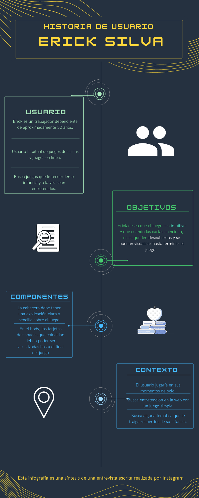
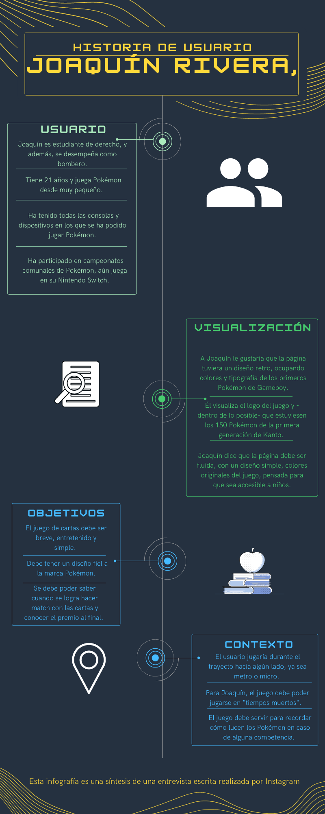
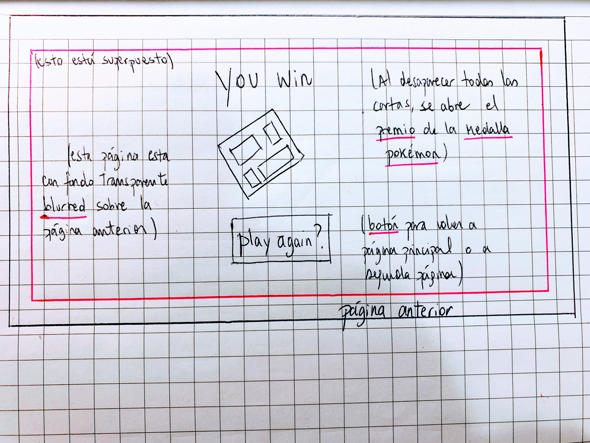
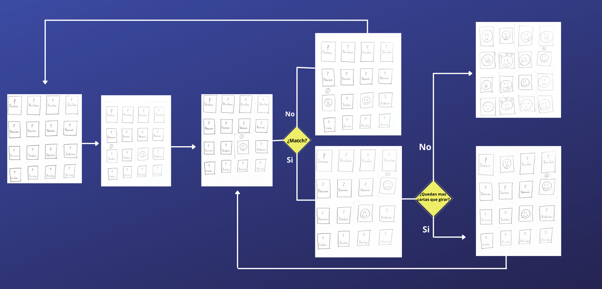

# Memory Dex Pokémon

## Índice

* [1. Definición del producto](#1-Definición-del-producto)
* [2. Definición del usuario](#2-Definición-del-usuario)
* [3. Prototipo de baja fidelidad](#3-Prototipo-de-baja-fidelidad)
* [4. Prototipo de alta fidelidad](#4-Prototipo-de-alta-fidelidad)
* [5. Test de usabilidad](#5-Test-de-usabilidad)

***

## 1. Definición del producto

25 años después del primer lanzamiento para Gameboy en el año 1996, Pokémon se ha consolidado como una de las franquicias más exitosas del mundo. Este juego nació en Japón de la mente de Satoshi Tajiri, y ahora, más de 50 títulos después, en Chile y a través de Laboratoria, usaremos su imaginario para crear un memory matching game. 

En este sentido, ¿a qué responde la creación de este juego online? Nuestros clientes, quienen son seguidores acérrimos de la saga Pokémon, nos presentaban el problema de entretenerse en bloques de tiempo breves usando esta temática. Nos contaron que esperaban que el juego pudiese tener una duración de pocos minutos, el que se pudiera repetir varias veces durante el traslado en metro o micro en Santiago, donde ellos también pudieran recordar a los pokémones de la primera generación de Kanto de manera simple, y que además, este evocara la estética de los primeros juegos (Pokémon Red & Blue para occidente).

Para responder a las necesidades de nuestros usuarios, decidimos crear una aplicación "memory matching game" o "memoríce" usando la temática de Pokémon. Por como está planteado el juego, este tiene el promedio de 1 minuto y medio de duración, usando 3 pantallas de visualización: introducción, juego de cartas y premio final. Tiene también un aspecto retro, similar al usado en la versión colorizada para Gameboy de 1997. 

Los invitamos a encontrar match en nuestros especímenes Pokémon: Gotta catch 'em all! ¡Atrápalos ya!

## 2. Definición del usuario

Nuestros usuarios son jóvenes millenials y de la generación Z que se han visto envueltos en el mundo del entretenimiento a través de los juegos de video, el anime y las series de televisión. Así como también en el uso innato del internet desde su nacimiento. 

Pokémon al ser una franquicia mundial que tiene juegos de video, serie de animación, live action, películas, juegos de mesa, campeonatos mundiales de cartas y gran etcétera, forma parte de la cultura popular con la que crecieron nuestros usuarios. 

En este sentido, si quisiéramos reducir a un público objetivo nuestro aplicación, diríamos que en su mayoría se encuentran usuarios del sexo masculino, desde los 9 años de edad -quienes se han visto dentro de la saga gracias a la serie infantil- hasta adultos dentro de los 30-35 años -quienes tuvieron el juego en su Gameboy o Nintendo, incluso llegando a jugar a los tazos Pokémon durante su escolaridad-. 

# 2.1 Historias de usuarios.

Para poder llegar a la definición de usuario anterior hicimos varias entrevistas escritas a través de Instagram, reduciendo estas experiencias a dos que fueron las que obtuvieron las respuestas más completas y de las cuales pudimos extrapolar el perfil de usuario que necesitábamos. 

A continuación te dejamos las dos historias de usuario, los criterios de aceptación y la definición de terminado en formato infografía:

* Historia de usuario I

* Criterios de aceptación y definición de terminado - Usuario 1

* Historia de usuario II

* Criterios de aceptación y definición de terminado -Usuario 2

/*AQUÍ HAY QUE ESCRIBIR LA DEFINICIÓN DE TERMINADO ÚNICO QUE CREAMOS CON LAS DOS DEFINICIONES QUE TENEMOS, HAY QUE MEZCLARLOS */

## 3. Prototipo de baja fidelidad

Durante un primer momento de planificación y creación, realizamos dos prototipos de baja fidelidad con la información que nos dieron los usuarios. 

Realizamos una versión más visual del modelo que queríamos para nuestra aplicación, en la que se muestra tentativamente los botones, diseño y despliegue que tendrá nuestra página. 

* Prototipo de baja fidelidad I

Para luego crear un prototipo de flujo en el que pudiésemos observar la dinámica de las pestañas y de las cartas. Así tendríamos todo ordenado para comenzar a crear el prototipo de alta fidelidad y saber por donde comenzar a la hora de crear nuestro código. 

* Prototipo de baja fidelidad II

## 4. Prototipo de alta fidelidad

Realizamos el prototipo de alta fidelidad en la herramienta de diseño Figma, donde podemos ver graficamente el diseño y funcionalidad del juego, además la interactividad de la pagina con el usuario.

* Prototipo de alta fidelidad I

* Prototipo de alta fidelidad II

* Prototipo de alta fidelidad III

Además, para poder realizar nuestra aplicación con diseño responsivo o *responsive* decidimos crear una versión de nuestro juego para dispositivos móviles. En esta oportunidad realizamos una versión para pantalla de celular Android, ya que es el sistema más usado en Chile.

Así es como luce nuestra versión para dispositivo móviles Android

* Página de introducción
 

* Juego de cartas 
 

* Mensaje de finalización del juego
 

## 5. Test de usabilidad